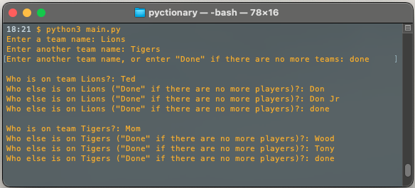

# Pyctionary

## Pyctionary is a Python3 implementation of the classic party game 'pictionary'

### To run
1. clone or download
2. from Terminal change to the directory where the code was downloaded to 
    `cd ../path/to/pyctionary/`
3. run `python3 main.py`
4. build your teams with players

5. enter the round duration, the default is 60seconds
6. start drawing... have fun!!!